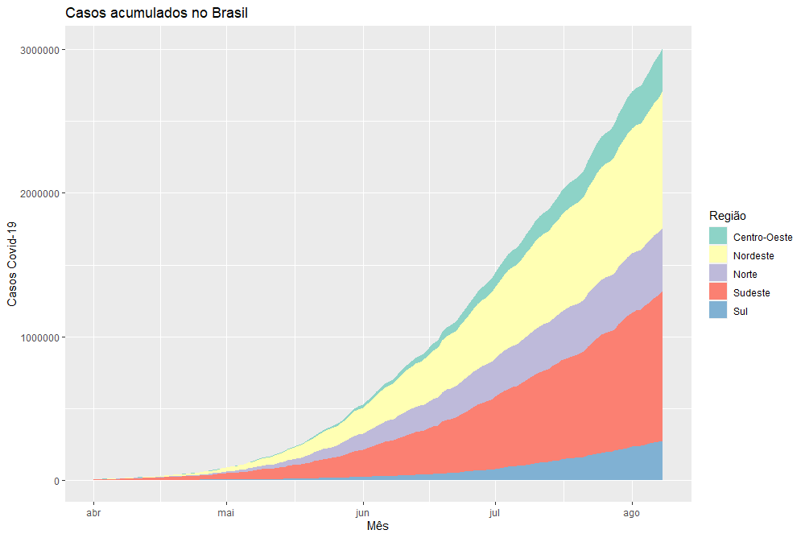

Análise de Dados feita com a linguagem de programação R, a partir do minicurso "Análise e Visualização de dados da COVID-19", lecionado pelo professor Marcus Carvalho.

# Brasil

Abaixo estarão os dados referente aos casos do Brasil. Dividindo em diferentes tipos de dados, como "Casos no Brasil", "Óbitos no Brasil", entre outros.

## Casos Acumulados

```{r, echo=FALSE}

```

## Óbitos Acumulados
```{r, echo=FALSE}

```


## Óbitos acumulados no Brasil (Dia da Semana)
É o mesmo gráfico, mas, está detalhado com os dias da semana.

```{r, echo=FALSE}

```

Anteriormente vimos os dados no final de Junho. Agora, vamos dar uma olhada até o começo de agosto, analisando a diferenciação entre os dois.

```{r, echo=FALSE}

```

# Regiões

## Casos acumulados por região

```{r, echo=FALSE}

```

### Casos acumulados por região (Até começo de Agosto)
```{r, echo=FALSE}

```

### Óbitos por região
#### Óbitos acumulados por região

```{r, echo=FALSE}

```

```{r, echo=FALSE}

```

Como se é possível analisar, os óbitos tiveram um aumento considerável, visto que no final de Junho, o máximo de casos era 50.000. Mas, no começo de Agosto esse número ultrapassa os 100.000
### Casos Acumulados por seus respectivos estados

```{r, echo=FALSE}

```

Está Bastante dificil para distinguir os estados, certo?
Então Vamos tentar dar uma melhorada utilizando escala logarítimica e dividindo os estados.

```{r, echo=FALSE}

```

Bem melhor. Como podemos ver

# Agradecimentos

Agradeço à Marcus Carvalho (Orientador) pela oportunidade de ter realizado esse trabalho. Por mais que não tive como focar 100% devido a problemas externos (impactando assim neste trabalho), sinto que o curso me deu um bom retorno.
